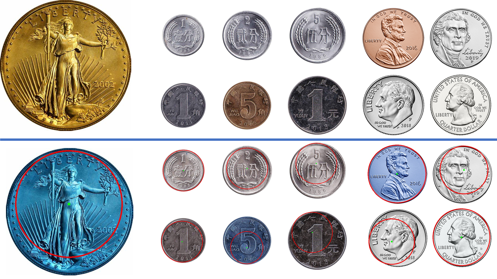
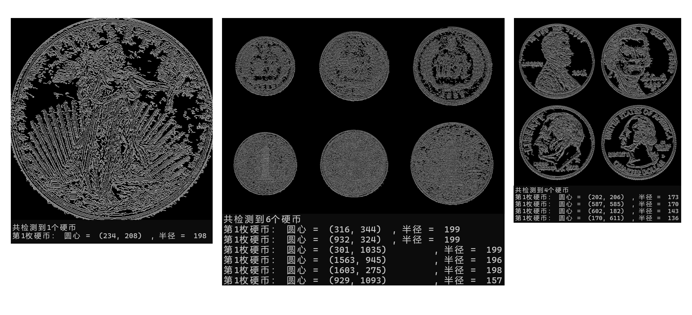

姓名：巩羽飞丨学号：2021522077丨班级：2021669101丨课程：计算机视觉

## Lab1_钱币定位系统

#### 一、任务描述

编写一个钱币定位系统，其不仅能够检测出输入图像中各个钱币的边缘，同时，还能给出各个钱币的圆心坐标与半径。

#### 二、算法整体流程

1. 读取输入图像。
2. 对输入图像进行预处理，包括高斯滤波、Sobel 边缘检测、非极大值抑制和双阈值检测。
3. 使用 Hough 变换检测硬币的圆心和半径。
4. 绘制检测结果，将检测到的硬币圆圈标记在原始图像上。
5. 保存结果图像。

#### 三、函数功能说明

- `gaussianKernel(k, sigma)`：生成高斯滤波器。参数 `k` 表示滤波器的大小，`sigma` 表示高斯分布的标准差。返回生成的高斯滤波器。$H_{ij}=\frac{1}{2\pi\sigma^2}e^{-\frac{(i-k)^2+(j-k)^2}{2\sigma^2}},\ \  其中\ i,j∈[0, 2k]$
- `conv2D(img, kernel, pad=(0, 0), stride=1)`：进行二维卷积操作。参数 `img` 为输入图像，`kernel` 为卷积核，`pad` 为图像的填充大小，`stride` 为卷积核的步长。返回卷积后的图像。
- `NMS(Gx, Gy)`：进行非极大值抑制。参数 `Gx` 和 `Gy` 分别为 `Sobel` 算子计算得到的水平和垂直梯度。返回进行非极大值抑制后的图像。
- `histBasedThreshold(img)`：根据直方图进行阈值分割。参数 `img` 为输入图像。返回阈值分割后的图像。
- `doubleThresholdDetection(src, HT, LT)`：进行双阈值检测。参数 `src` 为输入图像，`HT` 和 `LT` 分别为高阈值和低阈值。返回经过双阈值检测后的图像。
- `soberGrad(img)`：使用 `Sobel` 算子计算图像的梯度。参数 `img` 为输入图像。返回水平和垂直方向的梯度图像。

#### 四、最终拟合结果图

#### 五、简要分析

- **高斯滤波器大小和标准差**：影响图像的平滑程度，适当的参数可以去除噪声，但过大的参数会导致图像模糊。
- **双阈值检测中的高阈值和低阈值**：高阈值决定边缘像素，低阈值决定连接边缘的强度。适当的选择阈值可以保留有效的边缘信息。
- **Hough变换的参数**：param1 和 param2 是 Canny 边缘检测的参数，minRadius 和 maxRadius 是检测圆的半径范围。这些参数的选择直接影响了检测到的圆的数量和质量。

综上，合理选择参数对于最终定位结果至关重要。需要根据具体的图像特点和硬币的大小、形状等因素来调整参数以获得最佳的检测效果。

