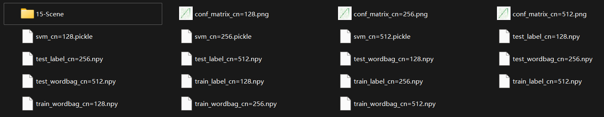
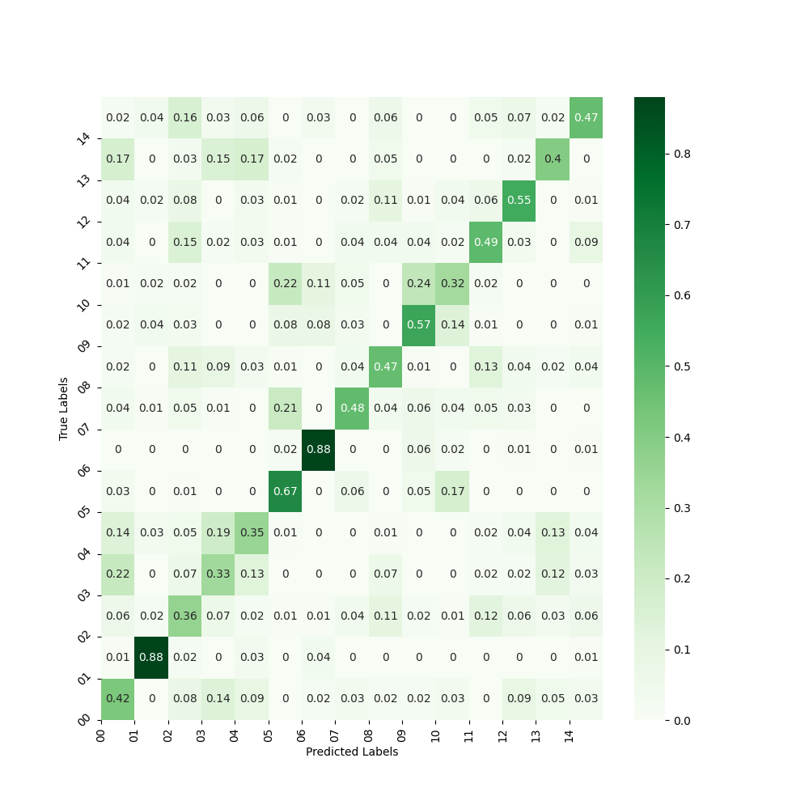
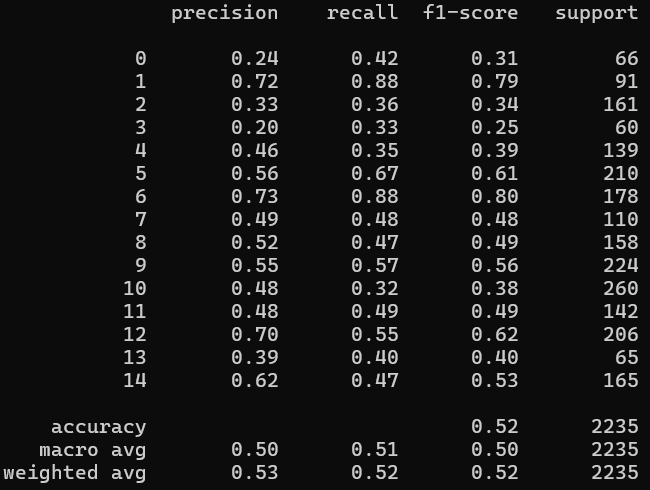
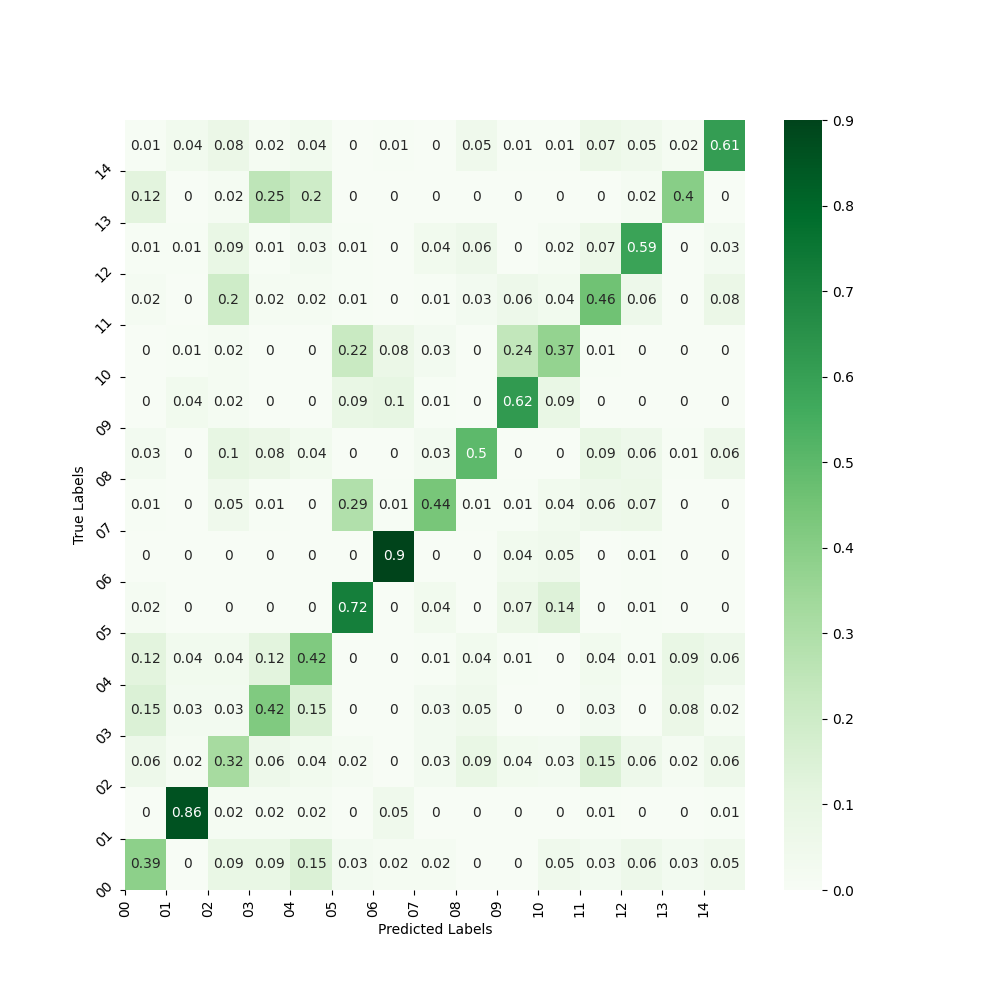
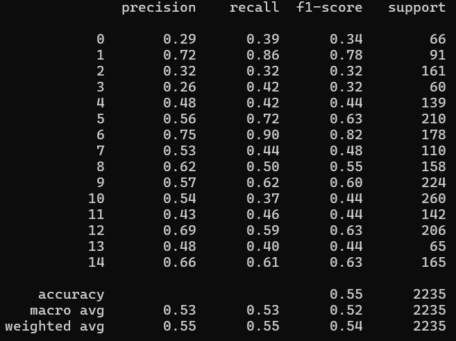
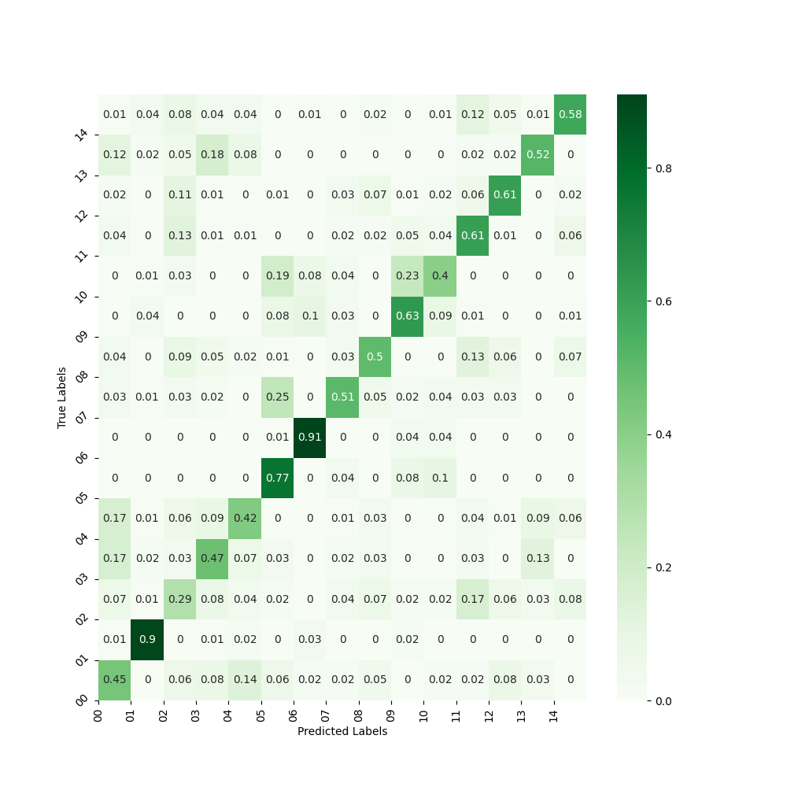

姓名：巩羽飞丨学号：2021522077丨班级：2021669101丨课程：计算机视觉

## Lab2_图像分类系统

#### 一、任务描述

编写一个图像分类系统，能够对输入图像进行类别预测。具体的说，利用数据库的2250张训练样本进行训练；对测试集中的2235张样本进行预测。

scene_categories数据集包含15个类别，每个类中编号前150号的样本作为训练样本，15个类一共2250张训练样本；剩下的样本构成测试集合。

#### 二、算法整体流程

1. 导入所需的库。
   
2. 定义函数 `siftExtract(data_path)`：
   - 读取数据集中的图像，并对其提取 SIFT 特征。
   - 将数据集分为训练集和测试集。
   
3. 定义函数 `kmeans(train_data, clusters_num)`：
   - 使用 MiniBatchKMeans 算法对 SIFT 特征进行聚类。
   
4. 定义函数 `sift2WordBagVector(data, kmeans)`：
   - 将 SIFT 特征转换为词袋模型。
   
5. 定义函数 `train(wordbag_path, label_path, save_model_path)`：
   - 加载训练数据和标签。
   - 使用 SVC 训练支持向量机模型。
   - 将训练好的模型保存到指定路径。
   
6. 定义函数 `test(data_path, model_path, test_data_path, test_label_path, conf_matrix_path)`：
   - 加载测试数据和标签。
   - 加载训练好的 SVM 模型。
   - 对测试数据进行预测。
   - 打印不同类别的分类报告。
   - 绘制混淆矩阵并保存为图片。
   
7. 定义主函数 `main()`：
   - 指定数据集路径和聚类簇数。
   - 对每个聚类簇数执行以下操作：
     - 提取 SIFT 特征并保存词袋模型。
     - 训练 SVM 模型并保存。
     - 对测试集进行测试，生成混淆矩阵并保存为图片。
   
8. 调用主函数 `main()` 执行整个流程。

#### 三、函数功能说明

1. **`siftExtract(data_path)`**：
   - 功能：读取图片并提取 SIFT 特征。
   - 参数：
     - `data_path`：数据集的根路径。
   - 返回值：训练数据、测试数据、训练标签、测试标签。
   - 过程：使用 OpenCV 的 SIFT 特征提取器从图像中提取 SIFT 特征。将数据集分为训练集和测试集，每个类别取前 150 张图片作为训练集，剩余的作为测试集。
2. **`kmeans(train_data, clusters_num)`**：
   - 功能：使用 KMeans 算法对 SIFT 特征进行聚类。
   - 参数：
     - `train_data`：训练数据。
     - `clusters_num`：聚类的簇数。
   - 返回值：KMeans 聚类模型。
   - 过程：将所有的 SIFT 特征堆叠成一个大的特征矩阵。使用 MiniBatchKMeans 对特征矩阵进行聚类，得到聚类中心。
3. **`sift2WordBagVector(data, kmeans)`**：
   - 功能：将 SIFT 特征转换为词袋模型。
   - 参数：
     - `data`：数据集。
     - `kmeans`：KMeans 聚类模型。
   - 返回值：词袋模型。
   - 过程：对于每个图像的 SIFT 特征，将其划分到最近的聚类中心，统计每个聚类中心的出现次数，得到一个直方图。
4. **`train(wordbag_path, label_path, save_model_path)`**：
   - 功能：使用 SVM 模型训练。
   - 参数：
     - `wordbag_path`：训练集词袋模型的路径。
     - `label_path`：训练集标签的路径。
     - `save_model_path`：模型保存的路径。
   - 返回值：无。
   - 过程：加载训练数据和标签。使用 SVC 训练支持向量机模型，并将训练好的模型保存到指定路径。
5. **`test(data_path, model_path, test_data_path, test_label_path, conf_matrix_path)`**：
   - 功能：测试模型的性能。
   - 参数：
     - `data_path`：数据集的根路径。
     - `model_path`：模型的路径。
     - `test_data_path`：测试集数据的路径。
     - `test_label_path`：测试集标签的路径。
     - `conf_matrix_path`：生成的混淆矩阵的保存路径。
   - 返回值：无。
   - 过程：加载测试数据和标签。加载训练好的 SVM 模型。使用模型对测试数据进行预测。打印不同类别的分类报告，并绘制混淆矩阵保存为图片。

#### 四、实验结果

实验设置了3种不同的聚类簇数，分别是128, 256和512，以下是输出结果预览：

对应的混淆矩阵如下：

- cluster_num = 128: 
	 
- cluster_num = 256:
	 
- cluster_num = 512:
	 

#### 五、简要分析

我们可以看到在所有情况下，都有一个 "weighted avg" 和 "macro avg" 的结果。"weighted avg" 是按照各类别样本数量加权计算的指标，更能反映整体的分类效果。"macro avg" 是简单地对各类别的指标取平均。这两个指标可以帮助我们理解整体性能。

1. cluster_num = 128: 
   - accuracy：0.52
   - weighted avg precision：0.53
   - weighted avg recall：0.52
   - weighted avg F1-score：0.52

2. cluster_num = 256:  
   - accuracy：0.55
   - weighted avg precision：0.55
   - weighted avg recall：0.55
   - weighted avg F1-score：0.54

3. cluster_num = 512: 
   - accuracy：0.58
   - weighted avg precision：0.59
   - weighted avg recall：0.58
   - weighted avg F1-score：0.57

通过对比这些指标，可以发现：**聚类簇数为512时的结果在整体性能上都稍微优于其他两种情况**。它具有更高的准确度、加权平均精确度和加权平均 F1 分数。

这表明，**使用更多的聚类簇可能使系统更好地对图像进行分类，因为它能够更好地捕获图像之间的细微差异，从而提高分类的准确性。**
